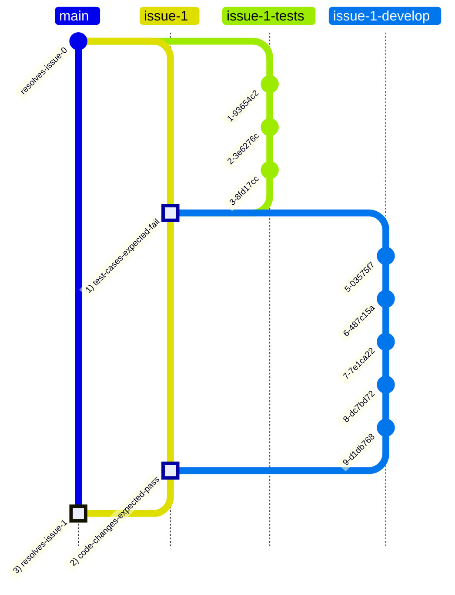

# The 3 Commit Method
 The "3 Commit" Method (3CM) is a git workflow based on interface- and test- driven development for maintaining complex code at scale.

- **Traceability**: Every resolved issue can be traced to a single commit on the `main` branch. Easy to revert if needed.
- **Quality Assurance**: Every code change includes matching test cases. The test suite grows with the code base, reducing risk of regressions.
- **Delivery At Scale**: This workflow decouples test development from code development, improving confidence in delivery at scale.

## GitHub Settings
1. Settings > Actions > General > Workflow permissions
    1. Enable "Allow GitHub Actions to create and approve pull requests"
    2. Enable "Allow Read and write permissions"
2. Settings > Branches > Branch protection rules
    1. Add rule for `main`
        1. Enable "Require a pull request before merging"
            1. Enable further checks as required by your project
        2. Enable "Require status checks to pass before merging"
            1. Enable "Require branches to be up to date before merging"
            2. Add Status Checks as required by your project
        3. Enable "Require conversation resolution before merging"
        5. Enable the "Do not allow bypassing the above settings" option
    2. Add rule for `issue-*`
        1. Same as above ^^
        

## Workflow Overview
1. Every issue is resolved in 3 commits.
    1. The first commit adds test cases that should fail.
    2. The second commit adds code that makes the test cases pass.
    3. The third commit merges both the code & the tests into main, and closes the issue.



### Automation
1. Issue branches are automatically created by a GitHub Action when an issue is created.
2. Pull Requests are used to merge code into issue branches.
3. Pull Requests are automatically tested using GitHub Actions.
4. Pull Requests are squash merged to keep the commit history clean.
5. Pull Requests can only be merged into the `main` branch when all tests pass.
6. The `main` branch is protected to ensure that all changes are made through Pull Requests.


### Step-by-Step Process

1. **Create a GitHub Issue**
   - A user creates a GitHub issue, which could be a feature request or a bug report.

2. **Automatic Branch Creation**
   - A GitHub Action automatically creates a branch from the head of `main` named `issue-xxx`, where `xxx` is the issue number.
   - This branch is protected, and direct commits are not allowed. All changes must be made through Pull Requests (PRs), and only squash merging is permitted.

   ```mermaid
   graph TD;
       A[Create GitHub Issue] --> B[GitHub Action: Create issue-xxx Branch];
       B --> C[Protected Branch: issue-xxx];
   ```

3. **First PR: Failing Test Cases**
   - The first PR for the `issue-xxx` branch must contain only test cases for the feature or bug.
   - These test cases must fail initially, as the corresponding code should not be written yet.
   - Once reviewed and approved, this PR is squash merged, resulting in a single commit on the `issue-xxx` branch.

   ```mermaid
   graph TD;
       D[Write Failing Test Cases] --> E[Create First PR];
       E --> F[Review & Squash Merge];
       F --> G[First Commit on issue-xxx];
   ```

4. **Second PR: Code Changes**
   - The second PR should include code changes that make the previously written test cases pass.
   - After the test cases pass and the PR is reviewed and approved, it is squash merged, forming the second commit on the `issue-xxx` branch.

   ```mermaid
   graph TD;
       H[Write Code to Pass Tests] --> I[Create Second PR];
       I --> J[Review & Squash Merge];
       J --> K[Second Commit on issue-xxx];
   ```

5. **Merge to Main**
   - Once the issue is resolved, a PR is raised to merge the `issue-xxx` branch into `main`.
   - The `main` branch is protected, requiring PRs for any merges.
   - After review and approval, the contents of the `issue-xxx` branch are squash merged into `main`, creating a single atomic commit with a reference to the issue number as `issue-xxx`. This is the third commit of the process.

   ```mermaid
   graph TD;
       M[Create PR to Merge into Main] --> N[Review & Squash Merge];
       N --> O[Single Atomic Commit on Main];
       O --> P[Resolve & Close Issue];
   ```
